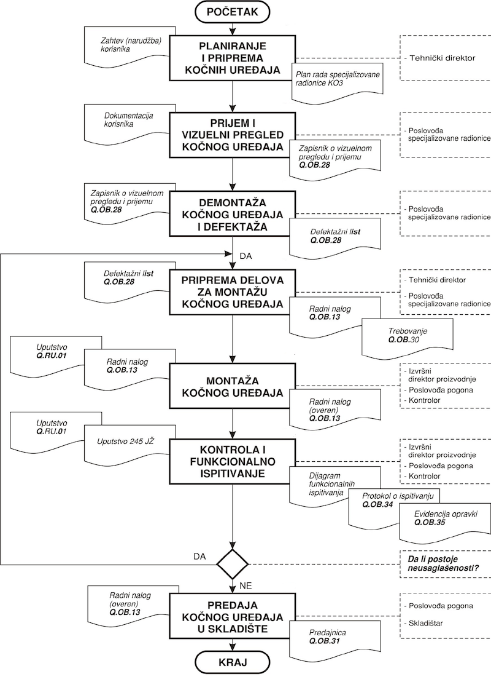




name: sadrzaj

# Sadržaj

- [Uvod](#uvod)
- [Predmet i problem istraživanja](#problem)
- [Istraživačke hipoteze](#hipoteze)
- [Lanci snabdevanja](#lanci)
- [Fazi skupovi](#fazi)
- [Adaptivni model](#model)
- [Rezultati istraživanja](#rezultati)
- [Zaključak](#zakljucak)
      
---
name: uvod
class: center, middle

# UVOD

---
layout: true

.section[[Uvod](#sadrzaj)]

---

## Uvod

- Oduvek je bilo od izuzetnog značaja za kompanije da ostanu međusobno povezane jer konkurencija nije više među samim organizacijama ‒ njeno težište pomerilo se na lance snabdevanja.  
- Danas preduzeća moraju da budu sposobna da efikasno odgovore na izazove koje im nameću promene u eri četvrte industrijske revolucije.   
- Kvalitet, vreme i cena su ključni zahtevi na koje preduzeće mora odgovoriti da bi opstalo na konkurentskom tržištu.  
- Tema ovog istraživanja su lanci snabdevanja, odnosno upravljanje njima sa ciljem zadovoljenja gore postavljenih zahteva.

---

name: problem
layout: false
class: center, middle

# PREDMET I PROBLEM ISTRAŽIVANJA

---
layout: true

.section[[Predmet i problem istraživanja](#sadrzaj)]

---

## Predmet i problem istraživanja

- Predmet istraživanja u okviru ove doktorske disertacije su modeli, metode i alati za upravljanje lancima snabdevanja i merenje kvaliteta usluge u njima.  
- Problem koji razmatra ova disertacija je poboljšanje usluga koje pružaju kompanije i ostvarivanje bolje komunikacije učesnika u lancu snabdevanja.  
- Takođe, problem istraživanja je kvalitetna procena usluge lanca snabdevanja, gde tu uslugu karakterišu grupe parametara, koje često nisu adekvatno procenjene vrednosti kao ni njihova važnost za procenu sistema. Ta nepreciznost je često posledica nesigurnosti ocenjivača, promenljivosti uslova, itd.

---

name: hipoteze
layout: false
class: center, middle

# ISTRAŽIVAČKE HIPOTEZE

---
layout: true

.section[[Istraživačke hipoteze](#sadrzaj)]

---

## Istraživačke hipoteze

.medium[
- U skladu sa predmetom i  problemom istraživanja postavljene su osnovne i pomoćne hipoteze.
- Osnovne hipoteze:
	- H1 – Moguće je razviti informacioni sistem koji se može primeniti u lancu snabdevanja.
	- H2 – Moguće je primeniti informacioni sistem u području uslužnih delatnosti.
	- H3 – Agregaciona funkcija – stepena sredina sa težinama dovoljno dobro procenjuje za određeni stepen (r) kvalitet usluge.
	- H4 – Fazi-agregaciona funkcija – fazi-stepena sredina sa težinama dovoljno dobro procenjuje kvalitet usluge ako su parametri neprecizni.
- Pomoćne hipoteze:
	- H4a – Fazi-agregaciona funkcija – fazi-stepena sredina sa težinama dovoljno dobro procenjuje kvalitet usluge ako su ocene parametara crisp vrednosti, a težinski koeficijenti fazi- brojevi.
	- H4b – Fazi-agregaciona funkcija – fazi-stepena sredina sa težinama dovoljno dobro procenjuje kvalitet usluge ako su ocene parametara i težinski koeficijenti fazi-brojevi.
]
---

name: lanci
layout: false
class: center, middle

# LANCI SNABDEVANJA

---
layout: true

.section[[Lanci snabdevanja](#sadrzaj)]

---

## Definicije

.medium[
.center-table.small[

| **Autor i godina**          | .center[**Definicija**]                                                                                                                                                                                                                                                                                                                                                                                                                                                                   |
|-------------------------|------------------------------------------------------------------------------------------------------------------------------------------------------------------------------------------------------------------------------------------------------------------------------------------------------------------------------------------------------------------------------------------------------------------------------------------------------------------------------|
| Stevens - 1989          | Lanac snabdevanja predstavlja sistem čiji su sastavni delovi: snabdevači materijala, proizvodni objekti, distributivne službe i korisnici, povezani zajedno preko toka materijala i povratnog toka informacija. Lancem snabdevanja se upravlja da bi se sinhronizovali zahtevi korisnika sa tokom materijala od snabdevača i izbalansira visok nivo usluge korisnika, nizak nivo zaliha i niski jedinični troškovi                                                           |
| Christopher - 1994      | Lanac snabdevanja predstavlja mrežu organizacija koje su povezane dvosmernim vezama, različitim procesima i aktivnostima koje stvaraju vrednost u obliku proizvoda i usluga za krajnjeg korisnika                                                                                                                                                                                                                                                                            |
| Chow i ostali - 1994    | Lanac snabdevanja obuhvata sve kompanije koje učestvuju u proizvodnji/preradi, prodaji i distribuciji proizvoda od izvorišta sirovina do krajnjih korisnika                                                                                                                                                                                                                                                                                                                  |
| Beamon - 1998           | Lanac snabdevanja je integrisani proces u kome se nalaze brojni različiti poslovni entiteti (snabdevači, proizvođači, distributeri i trgovci) koji rade zajedno sa ciljem da: nabavljaju sirovine, pretvaraju sirovine u određene gotove proizvode i isporučuju gotove proizvode trgovcima. Ovakav lanac tradicionalno je određen dvama tokovima: tokom materijala i povratnim tokom informacija                                                                             |
| Lummus i Vokurka - 1999 | Lanac snabdevanja su sve aktivnosti koje se odnose na isporuku proizvoda do korisnika, a u njih spadaju: snabdevanje sirovinama i delovima, proizvodnja i montaža, skladištenje i praćenje zaliha, unos narudžbina i upravljanje realizacijom narudžbine, distribucija duž svih kanala, isporuka korisnicima, kao i informacioni sistemi koji su neophodni za praćenje svih ovih aktivnosti                                                                                  |
| Min i Zhou - 2002       | Lanac snabdevanja je integrisani sistem koji sinhronizuje niz između zavisnih poslovnih procesa u cilju da se: nabavljaju sirovine i delovi, ove sirovine i delovi transformišu u gotove proizvode, dodaje vrednost ovim proizvodima, ovi proizvodi distribuiraju i promovišu bilo prodavcima bilo korisnicima i olakša razmena informacija između različitih poslovnih entiteta (kao što su snabdevači, proizvođači, distributeri, logistički davaoci usluga i maloprodaja) |
| Frazelle - 2002         | Lanac snabdevanja je mreža objekata (skladišta, fabrika, terminala, luka, maloprodajnih objekata i domaćinstava), transportnih sredstava (kamiona, vozova, aviona i okeanskih plovila) i logističkih informacionih sistema koji su povezani preko snabdevačevih snabdevača i korisnikovih korisnika                                                                                                                                                                          |

]
]

---
## Upravljanje

- Iz ovog istraživanja proizilazi da je lanac snabdevanja niz tri ili više subjekta i njihovih aktivnosti povezanih u jedinistven proces snabdevanja kupca proizvodom ili uslugom u svrhu zadovoljenja njegovih zahteva, gde svaki učesnik lanca raspolaže neophodnim informacijama u realnom vremenu koje su mu potrebne radi ostvarivanja povišenog kvaliteta pružene usluge.ref[1].   
- Ova definicija ukazuje na neraskidivu vezu lanca snabdevanja i upravljanja njime, s toga je istraživački problem ove disertacije *razvoj modela za upravljanje lancima snabdevanja*.

.footer.small[
*1. <a target="_blank" rel="noopener noreferrer" href="https://www.milovantomasevic.com/">Autor</a>*
] 

---
## Koncepti

.medium[
.center-table.small[
|                Svojstvo                | QR  Brzi odgovor (Quick Response) | CRP  Kontinualno popunjavanja zaliha (Continuous Replenishment) |                                Napredni CRP                               | VMI  Upravljanje zalihama od strane prodavca (Vendor Managed Inventory) |
|:--------------------------------------:|:-------------------------------:|:-------------------------------------------------------------:|:-------------------------------------------------------------------------:|:---------------------------------------------------------------------:|
| **Donošenje odluka za generisanje naloga** |           Maloprodavac          |                Ugovorom dogovoreni nivoi zaliha               | Ugovorom dogovoreni nivoi zaliha i njihovo stalno unapređenje (postepeno) |                                Prodavac                               |
|         **Vlasništvo nad zalihama**        |           Maloprodavac          |                        Bilo koja strana                       |                              Bilo koja strana                             |                                Prodavac                               |
|          **Nove veštine prodavca**         |   Veštine predviđanja tražnje   |             Predviđanje tražnje i kontrola zaliha             |                   Predviđanje tražnje i kontrola zaliha                   |    Predviđanje tražnje, kontrola zaliha i unapređenje maloprodajom    |

]
]

---

name: fazi
layout: false
class: center, middle

# FAZI SKUPOVI

---
layout: true

.section[[Fazi Skupovi](#sadrzaj)]

---

## Teorija

.medium[
- U cilju formiranja novog matematičkog modela koji često koristi neprecizne procene stručnjaka, najpodbniji elementi za rad sa takvim podacima su teorije fazi-skupova i sistema, preciznije fazi-brojeva kao i operacije sa njima. Takav model će poslužiti za procenu kvaliteta usluge u lancima snabdevanja.  

- Klasičan skup: 

 
$$ \chi : X  \rightarrow \big\{0,1\big\} $$

- Fazi skup:

 
	$$   \mu_{a}  : X  \rightarrow [0,1] $$ 

<ul>
	<li>
  		
Funkcija pripadanja \( \mu_{a}\) određuje stepen pripadanja elemanta \(x\) fazi skupa \(A\).
  $$  ^{ \alpha }A= \big\{x \in X  |  \mu_{A}\big(x\big)  \geq  \alpha \big\}   $$
		

  	</li>
</ul> 

]

---

## Definicije

.lcol-narrow.small[
- Fazi broj je fazi skup ako je:
<ol>
  <li>
  	
 
	 \( A\) - normalan tj. $$ h\big(a\big)=  \sup_{x\in X}  \mu _{a}  \big(x\big)=1 $$
	

  </li>  	

  <li>
  	
 
	 \(^{ \alpha }A\) je zatvoren interval
	

  </li>

  <li>
  	
 
	 Nosač \(^{ \alpha }A= \big\{x\in X | \mu _{a}  \big(x\big) > 0\big\} \) je ograničen.
	

  </li>
</ol> 

]

.rcol-wide.small[

 
	$$   ^{ \alpha }A= [A^{*}_{ \alpha},A^{**}_{ \alpha}]=[ \alpha  \cdot m + \big(1 -  \alpha \big) \cdot l, \alpha  \cdot m + \big(1 -  \alpha \big) \cdot r  ] $$ 

]

          
.small[

<ul>
	<li>
  		
Operacije sa fazi brojevima se defenišu preko  \( { \alpha }\)  -preseka tj. zatvorenih intervala, npr: 
  $$  [a,b]+[c,d]=[a+c,b+d]   $$
  $$  [a,b] \cdot [c,d]=[a \cdot c,b \cdot d]   $$
  $$  k \cdot [a,b] =[k \cdot a,k \cdot b]   $$
  $$  [a,b]^{n}=[a^{n},b^{n}]   $$
		

  	</li>
</ul> 

]

---

name: model
layout: false
class: center, middle

# ADAPTIVNI MODEL

---
layout: true

.section[[Adaptivni model](#sadrzaj)]

---
### AM4SCM

.lcol.small[
- Adaptivni model za upravljanje lancima snabdevanja (Adaptive Model for Supply Chain Management, AM4SCM) je kompleksan sistem koji povezuje funkcionalne i među funkcionalne poslovne procese i koji omogućava učesnicima u lancu snabdevanja upravljanje procesima u realnom vremenu. On se sastoji od:  
	- Modela za upravljanje lancima snabdevanja (Basic Supply Chain Management System, BSCMS)  
	- Modela za upravljanje korisničkim zahtevima (Service Desk) i  
	- Modela za ocenu kvaliteta pružene usluge (Fuzzy Aggregation Method for Quality Service (software), FAM4QS).  
- Hijerarhijska struktura adaptivnog modela za upravljanja lancima snabdevanja sa sedam nivoa aktivnosti i povratnim spregama koje omogućavaju stalno unapređivanje AM4SCM -a.
]

.rcol[

]

---
### Nivo 1 – analiza i definisanje aktivnosti

.lcol.small[
### model

- Utvrđivanje postojećeg stanja IT sistema koji se koriste (ako postoji),
- Definisanje mesta generisanja informacija, kao i procedura kontrole i unosa podataka,
- Definisanje potencijalnih korisnika,
- Definisanje zahteva potencijalnih korisnika,
- Utvrđivanje nivoa pristupa projektovanim informacijama,
- Definisanje i generisanje nivoa potrebnih informacija,
- Harmonizacija informacija sa drugim učesnicima koji participiraju lancu,
- Predaja sistem-analize projektnom timu za izradu softvera,
- Kontrola drafta softvera,
- Postavljanje linkova prema svim relevantnim subjektima,
- Evaluacija projekta, odnosno definisanje eventualnih promena koncepta i toka informacija na osnovu stvarnih potreba relevantnih učesnika imenovanih u lancu snabdevanja.
]

.rcol[
### verifikacija

.small[
- Osnovni dokumenti :
	- Zapisnik o prijemu, Defektažni list, Radni nalog, Trebovanje, Predajnica
]

]

---
### Nivo 2 – model za upravljanje lancima snabdevanja

.lcol.small[
### model

.medium[
- Ovakvim skupom integrisanih računarskih programa preduzeće dobija : 
	- Povezivanje svih delova preduzeća  u integralnu celinu, 
	- Povećanje preglednosti i organizovanosti preduzeća,
	- Egzaktno praćenje i prezentovanje informacija (u realnom vremenu),
	- Povećanje količine korisnih informacija,
	- Veliki broj izveštaja o poslovanju, 
	- Transparentnost poslovanja svih funkcija preduzeća,
	- Smanjenje troškova poslovanja,
	- Povećanje efikasnosti i profitabilnosti preduzeća,
	- Unapređenje kvaliteta poslovnih procesa.
]
]

.rcol[
### verifikacija

]

---
### Nivo 3 – prilagođavanje modela korisniku

.lcol.medium[
### model

- Na trećem nivou se prilagođava model zahtevima kompanije tako što se biraju procesi iz BSCMS ukoliko postoje u suportnom se kreiraju. 
]

.rcol.small[
### verifikacija

.medium[
.center-table.small[
| Slučaj korišćenja       | Dodaj servis na uređaju                                                                                                                                                |
|-----------------------------------------------------|------------------------------------------------------------------------------------------------------------------------------------------------------------------------|
| **Kratak opis**        | Dodavanje kočionog uređaja                                                                                                                                             |
| **Učesnici**                                            | Korisnik Intermehanike                                                                                                                                                 |
| **Uslovi koji moraju biti zadovoljeni pre izvršavanja** | Prijavljen na sistem                                                                                                                                                   |
| **Opis**                                                | Unos servisa za korisnikov kočioni uređaj: - Podaci:Broj servisa (automatski se kreira) - Datum remonta - Opis remonta - Garancija (mera vreme/km, dužina godina/50.000km |
| **Izuzeci**                                             | [Nije izabran datum remonta] Zahteva da se izabere datum, [Nije unet opis] Zahteva da se unese opis, [Nije unese garancija] Zahteva da se unese garancija                 |
| **Uslovi koji moraju biti zadovoljeni posle izvršavanj**a     | Servis dodat za kočioni uređaj i zabeležen u bazu podataka.                                                                                                                                                |

]
]
]

---
### Nivo 4 – definisanje, praćenje i kontrola procesa

.lcol.small[
### model

.medium[
- Funkcionalni model, odnosno proces BSCMS sistema, koji je sačinjen od četiri nivoa:
	- Prvi nivo čini definisanje partnera, definisanje podataka i dokumenata potrebnih zaposlovanje, nakon čega se definišu pravila o razmeni informacija i njihovoj dostupnosti.
]

.small[
- Planirani koraci su prevashodno u vezi sa definisanjem i primenom protokola između učesnika u SC-u. Neki od protokola koji bi trebalo da zažive su: 
	- Protokol o razmeni podataka u SC-u;
	- Protokol o ustupanju podataka trećim licima;
	- Protokol o permanentnom ažuriranju podataka;
	- Definisanje planiranih namena u SC-u;
	- Edukacija većeg broja korisnika za primenu i upotrebu BSCMS-a.
]
]

.rcol.small[
### verifikacija
- Priprema ulaznih parametara za sledeći nivo.
]

---
### Nivo 5 – implementacija

.lcol.small[
### model

- Na nivou 5 se izabrani procesi implementiraju i prilagođavaju preduzeću.
]

.rcol.small[
### verifikacija

]

---
### Nivo 6 – upravljanje korisničkim zahtevima

.lcol.small[
### model
.small[
 
 

]
]

.rcol[
### verifikacija

 

]

---
### Nivo 7 – ocenjivanje kvaliteta usluge

#### šestokoračni i lsp metod
.medium[
<ol>
  <li>
		Grupisanje servisa istog ranga.
  </li>  	

  <li>
  		Primena LSP metoda ei - predstavlja ocenu strucnjaka za servis a i wi- predstavlja važnosti tog servisa E - predstavlja celokupnu ocenu.
  	
 
	 $$   E=  \big(\sum_{i=1}^{k}  w_{i} \cdot e^{r}_{i} \big)^{ \frac{1}{r} }\; , \;0 \leq  w_{i}  \leq 1 \;, \; \sum_{i=1}^{k}  w_{i} = 1 $$
	 $$   e \in [0,1] \; , \;  E \in [0,1] \; , \; k \geq 2    $$  
	

  </li>
  <li>
	 Identifikujemo kriterijum poredjenja - stručnjaci ocenjuju.
  </li>
   <li>
    Određivanje granica (Donje granice (Lower control limit, LCL) i gornje (Upper control level, UCL).
  </li>
   <li>
	 Kako kaze praksa, granice za odredjivanje najboljeg i najlošijeg servisa će se korigovati uglavnom za 5-10%.
  </li>
   <li>
	 Uporediti najbolji i najlošiji - Dati preporuku.
  </li>

</ol> 

]

---
### Nivo 7 – ocenjivanje kvaliteta usluge
#### model FAM4QS

.small[

 
	 $$   E=  \big(\sum_{i=1}^{k}  w_{i} \cdot e^{r}_{i} \big)^{ \frac{1}{r} }\; , \;0 \leq  w_{i}  \leq 1 \;, \; \sum_{i=1}^{k}  w_{i} = 1 $$
	 $$   e \in [0,1] \; , \;  E \in [0,1] \; , \; k \geq 2    $$

	 $$   \Downarrow  $$ 

	 $$  \widehat{E} = \big(\widehat{w}_{1} \cdot \big(\widehat{e}_{1}\big) ^{r}+ ... + \widehat{w}_{n} \cdot \big(\widehat{e}_{n}\big) ^{r}  \big) ^{ \frac{1}{r} }   $$

	 $$   \Downarrow  $$ 
	
	$$   ^{\alpha}\widehat{E} =[ E^{*}, E^{**} ]= [ \big(\sum_{i=1}^{k}  w^{*}_{i} \cdot e^{r}_{i} \big)^{ \frac{1}{r} }\; ,\big(\sum_{i=1}^{k}  w^{**}_{i} \cdot e^{r}_{i} \big)^{ \frac{1}{r} }] $$

	$$   \Downarrow  $$ 

	 $$   UCL = [ 1.1 \cdot  \frac{1}{n} \sum_{i=1}^{n}  E^{*}_{i},1.1 \cdot  \frac{1}{n} \sum_{i=1}^{n}  E^{**}_{i}] \; \; LCL = [ 0.9 \cdot  \frac{1}{n} \sum_{i=1}^{n}  E^{*}_{i},0.9 \cdot  \frac{1}{n} \sum_{i=1}^{n}  E^{**}_{i}]  \Longleftarrow 10\%    $$ 

	 $$ LCL = [ 1.05 \cdot  \frac{1}{n} \sum_{i=1}^{n}  E^{*}_{i},1.05 \cdot  \frac{1}{n} \sum_{i=1}^{n}  E^{**}_{i}] \; \; LCL = [ 0.95 \cdot  \frac{1}{n} \sum_{i=1}^{n}  E^{*}_{i},0.95 \cdot  \frac{1}{n} \sum_{i=1}^{n}  E^{**}_{i}]  \Longleftarrow 5\% $$

]

---
### Nivo 7 – ocenjivanje kvaliteta usluge
#### verifikacija FAM4QS - grupisanje i ocenjivanje

.lcol.small[

.center-table.small[
|            Grupe           |                        Podgrupe                        |
|:--------------------------|:------------------------------------------------------|
| P1 = QS (kvalitet servisa) | P11 = Broj incidenata  P12 = Prosečno vreme rešavanja   |
| P2 = Dokumentacija         | P21 = Dokmentacija u kodu  P22 = Dokumentacija van koda |
| P3 = Odgovornost dobavljač | P31 = Fleksibilnost   P32 = Trošak   P33 = Stabilnost    |

]

 
.medium[
.center-table.small[
|<td colspan=4>.center[**Ocene za korisničke zahteve**]       
|:-----------------------------:|:-------:|:--------:|:-------:|:---------:|
| **rang**                        | **ocena** | **servis** | **br kz** | **ocenjen** |
| 0-25                        | 0,9   | 1      | 237   | 0,1     |
| 26-40                       | 0,8   | 2      | 55    | 0,7     |
| 41-60                       | 0,7   | 3      | 401   | 0,1     |
| 61-75                       | 0,6   | 4      | 19    | 0,9     |
| 76-90                       | 0,5   | 5      | 6     | 0,9     |
| 91-120                      | 0,4   | 6      | 54    | 0,6     |
| 121-150                     | 0,3   | 7      | 1     | 0,9     |
| 151-190                     | 0,2   | 8      | 13    | 0,9     |
| 191+                        | 0,1   | 9      | 5     | 0,9     |
|                             |       | 10     | 6     | 0,9     |
|                             |       | 11     | 2     | 0,9     |
|                             |       | 12     | 21    | 0,9     |
|                             |       | 13     | 4     | 0,9     |
|                             |       | 14     | 34    | 0,8     |
|                             |       | 15     | 80    | 0,5     |
|                             |       | 16     | 9     | 0,9     |
|                             |       | 17     | 10    | 0,9     |

]

]

]

.rcol.small[

.center-table.small[
|            Grupe           |                        Podgrupe                        |
|:--------------------------|:------------------------------------------------------|
| w1 = (0,45 ; 0,5 ; 0,6) | w11 = (0,25; 0,3; 0,4)  w12 = (0,65; 0,7; 0,8)   |
| w2 = (0,05 ; 0,15 ; 0,2)         | w21 = (0,4 ; 0,5 ; 0,55)  w22 = (0,45 ; 0,5 ; 0,6) |
| w3 = (0,20 ; 0,35 ; 0,45) | w31 = (0,25 ; 0,3 ; 0,4) w32 = (0,45 ; 0,5 ; 0,6) w33 = (0,15 ; 0,2 ; 0,35)    |

]

 
.medium[
.center-table.small[
|<td colspan=4>.center[**Ocene za prosečno vreme rešavanja**]       
|:-----------------------------:|:-------:|:--------:|:-------:|:---------:|
| **rang**                        | **ocena** | **servis** | **vreme** | **ocenjen** |
| 0-3   | 0,9   | 1      | 7,19  | 0,7     |
| 3-6   | 0,8   | 2      | 13,32 | 0,4     |
| 6-9   | 0,7   | 3      | 3,4   | 0,9     |
| 9-11  | 0,6   | 4      | 25,46 | 0,1     |
| 11-13 | 0,5   | 5      | 2,86  | 0,9     |
| 13-15 | 0,4   | 6      | 4,14  | 0,8     |
| 15-17 | 0,3   | 7      | 18,13 | 0,2     |
| 17-20 | 0,2   | 8      | 32,3  | 0,1     |
| 20+   | 0,1   | 9      | 6,58  | 0,7     |
|       |       | 10     | 6,3   | 0,7     |
|       |       | 11     | 14,92 | 0,4     |
|       |       | 12     | 8,8   | 0,7     |
|       |       | 13     | 11,31 | 0,5     |
|       |       | 14     | 11,07 | 0,5     |
|       |       | 15     | 6,49  | 0,7     |
|       |       | 16     | 9,04  | 0,6     |
|       |       | 17     | 5,77  | 0,8     |

]

]

]

---
### Nivo 7 – ocenjivanje kvaliteta usluge

.small[
#### verifikacija FAM4QS - rangiranje

 
	 $$   LCL = [ \color{red} 0\color{red}.\color{red}6\color{red}9\color{red}3  \; \; 0.772] \; \; UCL = [ 0.765 \; \; \color{red}0\color{red}.\color{red}8\color{red}1\color{red}1  ]  $$
	 $$   \Downarrow  $$  

.center-table.small[
| ProducdID -ServiceCode |    TD   | C(H/M/L) | DP | DT |    BD    | FAM4QS rezultat | RANG |
|:----------------------:|:-------:|:--------:|:--:|:--:|:--------:|:---------------:|:----:|
|          SCM14         | 3T,WO,J |     H    | IN |  A | FE,OL,IN |  [0,620, 0,656] | **C**|
|          SCM4          | 3T,WO,J |     H    | OH |  A | FE,OL,IN |  [0,653, 0,688] |   C  |
|          SCM8          | 3T,WO,J |     H    | OH |  A | FE,OL,IN |  [0,677, 0,714] |  *B* |
|          SCM1          | 3T,WO,J |     H    | OH |  A | FE,OL,IN |  [0,678, 0,715] |   B  |
|          SCM2          | 3T,WO,J |     H    | IN |  A | FE,OL,IN |  [0,697, 0,736] |   B  |
|          SCM13         | 3T,WO,J |     H    | IN |  A | FE,OL,IN |  [0,713, 0,755] |   B  |
|          SCM15         | 3T,WO,J |     H    | OH |  A | FE,OL,IN |  [0,720, 0,760] |   B  |
|          SCM11         | 3T,WO,J |     H    | IN |  A | FE,OL,IN |  [0,725, 0,765] |   B  |
|          SCM3          | 3T,WO,J |     H    | IN |  A | FE,OL,IN |  [0,726, 0,765] |   B  |
|          SCM7          | 3T,WO,J |     H    | IN |  A | FE,OL,IN |  [0,728, 0,768] |   B  |
|          SCM16         | 3T,WO,J |     H    | OH |  A | FE,OL,IN |  [0,737, 0,781] |   B  |
|          SCM9          | 3T,WO,J |     H    | OH |  A | FE,OL,IN |  [0,745, 0,793] |   B  |
|          SCM12         | 3T,WO,J |     H    | IN |  A | FE,OL,IN |  [0,757, 0,804] |   B  |
|          SCM6          | 3T,WO,J |     H    | OH |  A | FE,OL,IN |  [0,765, 0,809] |   B  |
|          SCM10         | 3T,WO,J |     H    | IN |  A | FE,OL,IN |  [0,778, 0,825] |  *B* |
|          SCM17         | 3T,WO,J |     H    | IN |  A | FE,OL,IN |  [0,797, 0,851] |   A  |
|          SCM5          | 3T,WO,J |     H    | IN |  A | FE,OL,IN |  [0,866, 0,921] | **A**|

]

 

	 $$   \Downarrow  $$  
	 $$   SCM14  \rightleftharpoons SCM5  $$ 

]

---
### Nivo 7 – ocenjivanje kvaliteta usluge
###### verifikacija FAM4QS - analiza

.small[
.lcol[

- Ukoliko se izvrši analiza lošije uspešnosti lanca snabdevanja 14 (SCM14) dolazi se do zaključka da su razlozi zato sledeći:
	- Analiza i specifikacija zahteva su urađene loše i nisu bile potpune.
	- Nedostupnost biznis korisnika programerima.
	- Nedovoljna bliskost timu koji razvija aplikaciju – programera i povremena odsutnost iz tima.
	- Nepostojanje povratne sprege između specifikacje zahteva i krajnjih korisnika (uticaj korisnika na specifikaciju zahteva je minimalan). 
]

.rcol[

- Da bi povećali nivo uspešnosti i smanjili tendenciju negativnog trenda kod SCM14 i lanaca sa sličnim osobinama predlažu se sledeći korci:
	- Detaljnija analiza zahteva i veća fleksibilnost modela, odnosno sistema (laka i brza prilagodljivost specifikacije novim potrebama).
	- Poboljšanja komunikacija između biznis korisnika i programera (veći broj direktnih sastanaka, češća komunikacija:m, s, t...).
	- Podizanje kvaliteta međuljudskih odnosa, radnog ambijenta i veća kontrola odsustva sa posla.
	- Uspostavljanje direktnih veza između krajnjih korisnika sa pružaocom usluge.
	- Povećanje brzine  i nivoa ažuriranosti sistema.
]
]

---

name: rezultati
layout: false
class: center, middle

# REZULTATI ISTRAŽIVANJA

---
layout: true

.section[[Rezultati istraživanja](#sadrzaj)]

---
## Modeli

- Adaptivni model koji se sastoji od:  
	- Model za upravljanje lancima snabdevanja (*BSCMS*)  
	- Model za upravljanje korisničkim zahtevima (*Service Desk*)  
	- Matematički model za ocenu kvaliteta pružene usluge (*FAM4QS*)  
- Glavna karakteristika adaptivnog modela je *algoritam sa precizno definisanim koracima* koje korisnik treba da sprovede da bi podigao nivo kvaliteta usluge i održao stabilnost lanca snabdevanja. Na taj način omogućeno je sortiranje lanaca snabdevanja i uočavanje “najboljeg i najlošijeg” u cilju daljeg poboljšanja. 

---
## Primena modela i verifikacija hipoteza

- Razvijeni adaptivni model je primenjen na slučaj preduzeća Intermehanika sa sedištem u Smederevu. To preduzeće sa svojim dobavljačima i korisnicima njenih usluga čini jedan lanac snabdevanja vezanih za delatnost proizvodnje kočionih uređaja kao i pružanja usluga njihovog održavanja. Stoga  su potvrđene hipoteze H1 i H2.  
- FAM4QS  je primenjen na 17 lanaca snabdevanja sa teritorije Republike Srbije. U zavisnosti od prirode parametara tim stručnjaka vrši izbor stepena r, odnosno određuje konjuktivnost (disjunktivnost) forme funkcje agregacije i daje dovoljno dobru procenu kvaliteta servisa. Time su hipoteze H3 i H4 potvrđene.   
- Ocena kvaliteta usluge tj. izračunavanje vrednosti funkcije agregacije je vršeno i za slučajeve kada su procene težinskih koeficijenata bile i realni i fazi-brojevi, a ocene parametara fazi-brojevi, na osnovu čega su verifikovane pomoćne hipoteze H4a i H4b. 

---
name: zakljucak
layout: false
class: center, middle

# ZAKLJUČAK

---
layout: true

.section[[Zaključak](#sadrzaj)]

---

## Doprinos

.medium[
- Razvijeni adaptivni model je moguće primeniti u velikom broju malih i srednjih uslužnih preduzeća koja posluju u Srbiji, ali i šire. *Sve interesne grupe će imati korist od detaljne specifikacije modela* kao i dobru podlogu za razvoj i implementaciju budućih sistema, metoda i modela. Uvođenje sistema u preduzeće „Intermehanika” doprinelo je boljem poslovanju i na taj način su izbegnuti problemi kao što su: smanjenje grešaka, smanjenje troškova itd., a samim tim i povećanje kvaliteta rada.  Drugim rečima, učesnicima lanca snabdevanja ovaj *model omogućuje podlogu za ostvarivanje kompetitivne prednosti u odnosu na druge lance* na tržištu.  

- Predstavljeni model je dovoljno uopšten i uz određena podešavanja i viši nivo integracije *može se primeniti u različitim oblastima* materijalne i nematerijalne proizvodnje.
]

---

## Buduća istraživanja

- Istraživanja su pokazala da postoje i određena ograničenja koja iziskuju pažnju i trebaju biti predmet daljih istraživanja u budućnosti:   
	- Primena neuralnih mreža.    
	- Razvoj veb platforme otvrenog tipa koja bi omogućila kreiranje novih lanaca snabdevanja.   
	- Primena adaptivnog modela u internom poslovanju učesnika lanca snabdevanja.

---
## .center[ *HVALA NA PAŽNJI* ]
    
.center[
.attention[
**PITANJA ?**]
]

.footer.small[
Dokutorsku disertaciju u pdf formatu možete detaljno pročitati na sajtu <a target="_blank" rel="noopener noreferrer" href="http://nardus.mpn.gov.rs/handle/123456789/9234">Ministarstva prosvete, nauke i tehnološkog razvoja.</a>
] 

